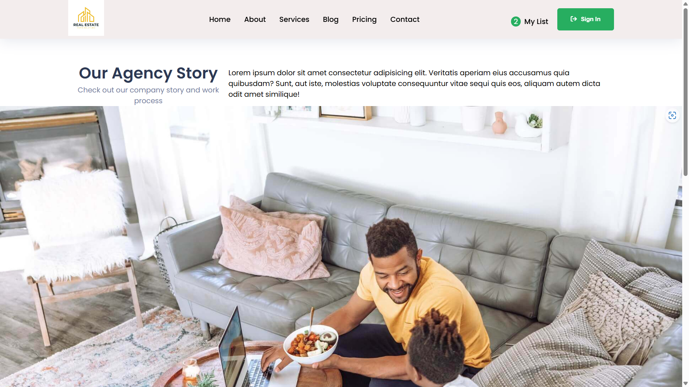

# Search Your Next Home

## Overview
Search Your Next Home is a web application built using React that allows users to search for their next dream home.

## Features

- Search for homes based on location, price range, number of bedrooms/bathrooms, and other criteria.
- View detailed information about each property, including descriptions, amenities, and photos.
- Save favorite listings to revisit later.
- Contact agents or sellers directly through the app.
- Responsive design for seamless browsing on desktop and mobile devices.

## Demo

You can view a live demo of the Search Your Next Home app [here](https://search-your-next-home-frontend-project.vercel.app/).

## Usage

- Enter your search criteria in the search bar (e.g., location, price range, etc.).
- Browse through the search results and click on a listing for more details.
- Use the save button to add listings to your favorites.
- Contact agents or sellers for more information or to schedule a viewing.

## Technologies Used

- React
- HTML5
- CSS3
- JavaScript

## Screenshot
 





## Getting Started

These instructions will get you a copy of the project up and running on your local machine for development and testing purposes.

### VS Code Setup

To set up the project in Visual Studio Code (VS Code):

1. If you haven't already, download and install VS Code from [here](https://code.visualstudio.com/).

2. Open VS Code.

3. Open the cloned project directory in VS Code:

   - Click on `File` > `Open Folder...`
   - Navigate to the `know-weather-of-your-city` folder and click `Select Folder`.

4. Open the `index.html` file in VS Code to start working on the project.


## Installation

1. Clone the repository:
   ```
   git clone https://github.com/ANANDRAJ012/Search_Your_Next_Home-Frontend-project.git
   ```
2. Install dependencies:
   ```
   cd react-to-do-list
   npm install
   ```
3. Start the development server:
   ```
   npm start
   ```
4. Open your web browser and go to http://localhost:3000 to view the app.


Feel free to explore and build upon this project to create a fully functional Search Your Next Home application. For any questions or assistance, please don't hesitate to reach out to us. Happy coding and happy shopping!

